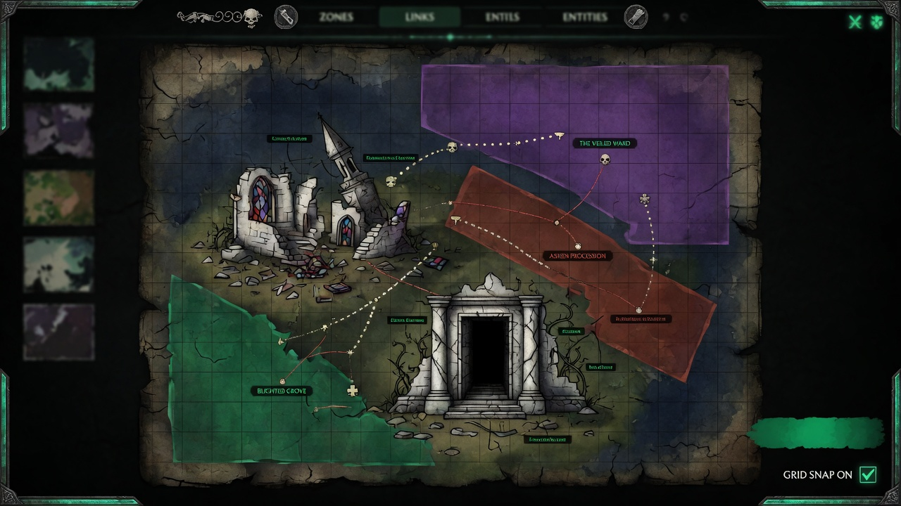

<p align="center">
  <a href="README.ja.md">日本語</a> | <a href="README.zh.md">中文</a> | <a href="README.md">English</a> | <a href="README.fr.md">Français</a> | <a href="README.hi.md">हिन्दी</a> | <a href="README.it.md">Italiano</a> | <a href="README.pt-BR.md">Português (BR)</a>
</p>

<p align="center">
  
</p>

<p align="center">
  
</p>

<p align="center">
  <a href="https://github.com/mcp-tool-shop-org/world-forge/actions/workflows/ci.yml"></a>
  <a href="https://www.npmjs.com/package/@world-forge/schema"></a>
  <a href="https://opensource.org/licenses/MIT"></a>
  <a href="https://mcp-tool-shop-org.github.io/world-forge/"></a>
</p>

<p align="center">2D / 2.5D world authoring studio with peer export lanes for <a href="https://github.com/mcp-tool-shop-org/ai-rpg-engine">AI RPG Engine</a>, <a href="https://www.unrealengine.com/">Unreal Engine 5</a>, and <a href="https://godotengine.org/">Godot 4</a>.<br>One editor, many modes — paint zones, place entities, define districts, export a complete content pack for your engine of choice.</p>

<!-- version:start -->
<p align="center"><strong>v4.7.0</strong> — 3385 tests, 6 shipping packages, 7 authoring modes, tiles + interiors + town authoring + world modeling (vertical strata, typed hazards, party-gated zones), three export targets (AI RPG Engine, Unreal Engine 5, Godot 4), and a measured Forge→Engine content contract</p>
<!-- version:end -->

## Arquitectura

```
packages/
  schema/          @world-forge/schema         — spatial types, validation, 2.5D fields
  export-ai-rpg/   @world-forge/export-ai-rpg  — AI RPG Engine export pipeline + CLI
  export-unreal/   @world-forge/export-unreal  — Unreal Engine 5 export pipeline + CLI (2.5D aware)
  export-godot/    @world-forge/export-godot   — Godot 4 export pipeline + .tscn scene generation
  renderer-2d/     @world-forge/renderer-2d    — PixiJS 2D canvas renderer
  editor/          @world-forge/editor         — React web authoring app
```

## Primeros pasos

```bash
npm install
npm run build
npm run dev --workspace=packages/editor
```

Abra `http://localhost:5173` para iniciar el editor.

### Flujo de trabajo del editor

1. **Elija un modo:** mazmorra, distrito, mundo, océano, espacio, interior o naturaleza salvaje, para establecer los valores predeterminados de la cuadrícula y el vocabulario de conexión.
2. **Comience con un kit:** seleccione un kit inicial o una plantilla de género del Administrador de plantillas, o comience desde cero.
3. **Pinte zonas:** arrastre sobre el lienzo para crear zonas, conéctelas y asigne distritos.
4. **Coloque entidades:** coloque PNJ, enemigos, comerciantes, encuentros y objetos en las zonas.
5. **Revise:** abra la pestaña de revisión para ver el estado general, una descripción general del contenido y exporte un resumen (Markdown/JSON).
6. **Exporte:** abra el modal de exportación para ver el estado de preparación por destino (✓ Listo / ⚠ advertencias), configure las opciones de destino y luego descargue los paquetes AI RPG Engine, UE5 o Godot 4. Los recibos posteriores a la exportación se acumulan con detalles sobre el tamaño, la cantidad y la fidelidad. También: paquetes de proyectos (.wfproject.json) y resúmenes de revisión.

### Exportación desde la línea de comandos (CLI)

```bash
# AI RPG Engine
npx world-forge-export project.json --out ./my-pack
npx world-forge-export project.json --validate-only
npx world-forge-export --import ./my-pack --out ./round-trip

# Unreal Engine 5
npx world-forge-export-unreal project.json --out ./UnrealPack --sign
npx world-forge-export-unreal --summary ./UnrealPack

# Godot 4 — writes a loadable project root (project.godot + world.tscn)
npx world-forge-export-godot project.json --out ./GodotPack
npx world-forge-export-godot project.json --validate-only
```

## Paquetes

### @world-forge/schema

Tipos centrales de TypeScript y validación para la creación de mundos.

- **Spatial types** — `WorldMap`, `Zone`, `ZoneConnection`, `District`, `Landmark`, `SpawnPoint`, `EncounterAnchor`, `FactionPresence`, `PressureHotspot`
- **Content types** — `EntityPlacement`, `ItemPlacement`, `DialogueDefinition`, `PlayerTemplate`, `BuildCatalogDefinition`, `ProgressionTreeDefinition`
- **Visual layers** — `AssetEntry`, `AssetPack`, `Tileset`, `TileLayer`, `PropDefinition`, `PropPlacement`, `AmbientLayer`
- **Town + structures** — `MarketNode`, `CraftingStation`, `Building`, `Hub`, `Stronghold`
- **World modeling** — `Stratum` + `StratumLink` (vertical layers), `HazardDefinition` (typed effects union), `ZoneEntryGate` + party-state `SpawnCondition` operands (`party-level`, `party-size`, `item`, `flag`, `member`, `class`)
- **Mode system** — `AuthoringMode` (7 modes), mode-specific grid/connection/validation profiles
- **Validation** — `validateProject()` (89 structural checks with Map-based O(n) lookups, `warningCount`), `advisoryValidation()` (mode-specific suggestions, metadata completeness, asset naming). v4.0 JSON that omits later required arrays is accepted after `normalizeProjectShape()` / `stampProjectSchemaVersion()`.
- **Closed unions on the barrel** — `VALID_CONNECTION_KINDS`, `VALID_ASSET_KINDS`, `VALID_ENTITY_ROLES`, `VALID_ITEM_SLOTS`, and the rest of the `VALID_*` sets export from `@world-forge/schema`.
- **Utilities** — `assembleSceneData()` (visual bindings with missing-asset detection), `scanDependencies()` (reference graph analysis), `buildReviewSnapshot()` (health classification)

### @world-forge/export-unreal

Convierte un `WorldProject` en un paquete de contenido para Unreal Engine 5, optimizado para juegos 2.5D.

- **Salida:** `pack.json`, JSON de datos primarios por zona y por distrito, manifiesto agrupado de generación de actores, sugerencias de transmisión de niveles por conexión, sugerencias de celdas de World Partition e informe estructurado de fidelidad.
- **Campos 2.5D:** `Zone.elevation`, `elevationRange`, `parallaxLayers`, `skylineRef` se conservan y se convierten a coordenadas UE cm / Z-up.
- **Transformación de coordenadas:** funciones puras (`pixelsToUnrealCm`, `elevationToZ`, `worldForgeToUnrealAxis`, `gridToUnrealAxis`). La escala mundial predeterminada es 1 casilla = 100 cm.
- **Importación de ida y vuelta:** `importFromUnreal` reconstruye un WorldProject a partir de un paquete de Unreal; los datos solo para el juego (diálogos, progresión, construcciones) se marcan como eliminados en el informe de fidelidad.
- **CLI:** `world-forge-export-unreal` con `--out`, `--tile-size-cm`, `--validate-only`, `--verbose`.

### @world-forge/export-godot

Convierte un `WorldProject` en un paquete de contenido para Godot 4 con texto de escena `.tscn`.

- **Salida:** una raíz de proyecto de Godot 4: `project.godot`, `world.tscn` (ExtResource `.tres`), texturas copiadas debajo de `assets/`, `scripts/player.gd`, más `pack.json` y `fidelity.json`.
- **CLI:** `world-forge-export-godot` con `--out`, `--validate-only`, `--include-world-tscn` / `--no-world-tscn`.
- **Escena jugable:** `buildWorldScene()` emite una escena navegable `.tscn`: colisión por zona `StaticBody2D` + `NavigationRegion2D`, un marco `Camera2D`, un avatar de jugador `CharacterBody2D` y ordenación Y / profundidad `z_index`.
- **Mosaicos + interiores:** `TileMapLayer` + `TileSet` (texturas horneadas `tile_map_data` para conjuntos de mosaicos de imágenes), colisión de pared por celda `StaticBody2D` y colocaciones de accesorios `Node2D`.
- **Ciudad:** mercados + estaciones de artesanía, y edificios (huellas `StaticBody2D`) / centros / fortalezas como marcadores de posición `Node2D`, todos los cuales llevan sus datos como metadatos.
- **Modelado del mundo:** estratos verticales (bandas por zona `z_index` + conectores `StratumLink`), peligros tipificados como regiones `Area2D` y metadatos de entrada de zona.
- **Informe de fidelidad:** seguimiento estructurado de los datos sin pérdidas, aproximados y eliminados, verificados con el motor real de Godot 4 (humo sin conexión, 36 aserciones).
- **Versión del formato:** `GODOT_PACK_FORMAT_VERSION` 1.1.0 (`files`, `zoneGates`, `migrateGodotPack`).

### @world-forge/export-ai-rpg

Convierte un `WorldProject` en el formato `ContentPack` de ai-rpg-engine.

- **Exportación:** zonas, distritos, entidades, objetos, diálogos, plantilla de jugador, catálogo de construcciones, árboles de progresión, encuentros, facciones, puntos calientes, manifiesto y metadatos del paquete.
- **Importación:** 8 convertidores inversos reconstruyen un WorldProject a partir del JSON exportado; CLI `--import` / `--from-pack` escribe `world-project.json` (o stdout).
- **Informe de fidelidad:** seguimiento estructurado de lo que se conservó sin pérdidas, se aproximó o se eliminó durante la conversión; `--out` escribe `fidelity.json` junto con el paquete.
- **Detección de formato:** detecta automáticamente los formatos WorldProject, ExportResult, ContentPack y ProjectBundle.
- **CLI:** `world-forge-export` con `--out`, `--import`, `--from-pack`, `--validate-only`, `--dry-run` y `--verbose`.

### @world-forge/renderer-2d

Motor de renderizado 2D basado en PixiJS: ventana con panorámica/zoom, superposiciones de zona con coloración de distrito, flechas de conexión, iconos de entidad por rol, capas de mosaicos y un minimapa.

Un motor de renderizado independiente publicado para que los consumidores externos incrusten datos de World Forge en su propia aplicación PixiJS. **El editor no lo utiliza:** el lienzo del editor es una implementación directa de Canvas2D, por lo que las funciones de minimapa y ventana que se enumeran a continuación en el editor son propias, no de este paquete.

### @world-forge/editor

Aplicación web React 19 + Vite con administración de estado de Zustand, deshacer/rehacer con etiquetas de acción, guardado automático (intervalo de 30 segundos, historial de 3 versiones, recuperación en caso de fallo), protecciones de estado "sucio" en todos los caminos de carga del proyecto, alternancia de temas claro/oscuro, trampas de enfoque modal y cambio de herramientas controlado por teclado.

#### Pestañas del espacio de trabajo

| Pestaña | Propósito |
|-----|---------|
| Mapa | Edición de zonas, entidades y distritos en el lienzo 2D. |
| Objetos | Árbol jerárquico: distritos → zonas → entidades/puntos de referencia/áreas de aparición. |
| Jugador | Plantilla de personaje con estadísticas, inventario, equipo y punto de aparición |
| Construcciones | Arquetipos, trasfondos, rasgos, disciplinas, combinaciones |
| Árboles | Nodos de progresión con requisitos y efectos |
| Diálogo | Edición de nodos, enlace de opciones, detección de referencias rotas |
| Preajustes | Navegador de preajustes de región y encuentro con fusión/reescritura |
| Activos | Biblioteca de activos con búsqueda filtrada por tipo, detección de elementos huérfanos, paquetes de activos |
| Problemas | Validación agrupada en tiempo real con navegación "hacer clic para enfocar" |
| Dependencias | Escáner de dependencias con botones de reparación integrados |
| Revisión | Panel de control de estado, resumen del contenido, exportación resumida |
| Guía | Lista de verificación para el primer uso con referencia de teclas rápidas |

#### Lienzo y edición

- **Herramientas:** seleccionar, pintar por zonas, conectar, colocar entidad, punto de referencia, punto de aparición, colocar objeto, colocar encuentro
- **Selección múltiple:** hacer clic con la tecla Mayús presionada, selección por recuadro, Ctrl+A; arrastrar para mover con deshacer atómico
- **Alineación:** alineación en 6 direcciones (izquierda/derecha/arriba/abajo/centro horizontal/centro vertical) y distribución horizontal/vertical
- **Ajuste:** ajuste al arrastrar a los bordes/centros de los objetos cercanos con líneas guía visuales
- **Redimensionar:** 8 controles por zona con ajuste a los bordes, limitación del tamaño mínimo, vista previa en tiempo real
- **Duplicar:** Ctrl+D con ID, conexiones y asignaciones de distrito reasignados
- **Copiar/Pegar:** Ctrl+C / Ctrl+V con reasignación de ID y desplazamiento configurable
- **Ciclo de clics:** clics repetidos en la misma posición para recorrer los objetos superpuestos
- **Menú contextual:** haga clic derecho para 7 acciones sensibles al contexto (propiedades, eliminar, duplicar, etc.)
- **Vista previa de conexión:** línea cian discontinua durante la colocación de la herramienta de conexión
- **Minimapa:** vista general de 200×150 (esquina inferior derecha), haga clic para saltar
- **Eliminación de objetos en el área visible:** solo se representan los objetos dentro de los límites visibles (margen de 64 píxeles)
- **Estadísticas de rendimiento:** alternar superposición de FPS/recuento de objetos/tiempo de renderizado
- **Visibilidad por objeto:** ocultar/mostrar objetos individuales (guardado en localStorage)
- **Capas:** controles de visibilidad (cuadrícula, conexiones, entidades, puntos de referencia, puntos de aparición, ciudad, mosaicos, accesorios, ambiente; los elementos interactúan con la capa de elementos)

#### Navegación y atajos

- **Área visible:** mover/acercar la cámara, acercar con la rueda del ratón (cursor anclado), arrastrar con la barra espaciadora/botón central del ratón/clic derecho, ajuste automático al contenido, hacer doble clic para centrar
- **Búsqueda:** Ctrl+K abre una superposición para encontrar cualquier objeto por nombre/ID con coincidencia aproximada, navegación con el teclado y historial de búsqueda reciente (localStorage)
- **Panel de velocidad:** haga doble clic con el botón derecho para obtener una paleta de comandos flotante con acciones sensibles al contexto, favoritos fijables, macros y acciones rápidas sugeridas según el modo
- **Teclas rápidas:** 21 atajos de teclado que incluyen cambio de herramienta (V/Z/C/E/L/S), Enter (abrir detalles), P (aplicar preajuste), Mayús+P (guardar preajuste), Ctrl+C/V (copiar/pegar), ajuste con las flechas (Mayús = 5×)
- **Accesibilidad:** trampas de enfoque modal con Escape para cerrar, etiquetas ARIA en todos los botones que solo tienen iconos, árbol de objetos navegable con el teclado, indicador de cambios anunciado por un lector de pantalla. Las operaciones del lienzo espacial (colocación, selección por recuadro, redimensionamiento, dibujo de conexiones, desplazamiento) siguen siendo basadas en puntero

#### Importar y exportar

- **ContentPack:** exportación con conocimiento del destino a AI RPG Engine, Unreal Engine 5 o Godot 4 con insignias de preparación por destino, opciones configurables (tamaño del mosaico, prefijos de escena, filtrado de paquetes) y recibos posteriores a la descarga
- **Paquetes de proyecto:** archivos `.wfproject.json` portátiles con metadatos de procedencia e información de dependencia
- **Paquetes de kit:** exportación/importación `.wfkit.json` con validación, manejo de colisiones y seguimiento de la procedencia
- **Importar:** detecta automáticamente 4 formatos con informes estructurados de fidelidad
- **Diferencias:** seguimiento semántico de los cambios desde la importación
- **Vista previa de escena:** composición HTML/CSS en línea de todas las vinculaciones visuales de la zona

## Modos de creación

World Forge separa el **género** (fantasía, ciberpunk, pirata) del **modo** (mazmorra, océano, espacio). El género es un adorno; el modo es la escala. El modo rige los valores predeterminados de la cuadrícula, el vocabulario de conexión, las sugerencias de validación, la redacción de la guía y el filtrado de preajustes.

| Modo | Cuadrícula | Mosaico | Conexiones clave |
|------|------|------|-----------------|
| Mazmorra | 30×25 | 32 | puerta, escaleras, pasaje, secreto, peligro |
| Distrito / Ciudad | 50×40 | 32 | carretera, puerta, pasaje, portal |
| Región / Mundo | 80×60 | 48 | carretera, portal, pasaje |
| Océano / Mar | 60×50 | 48 | canal, ruta, portal, peligro |
| Espacio | 100×80 | 64 | acoplamiento, salto warp, pasaje, portal |
| Interior | 20×15 | 24 | puerta, escaleras, pasaje, secreto |
| Tierra baldía | 60×50 | 48 | sendero, carretera, pasaje, peligro |

El modo se establece al crear un proyecto y se guarda como `mode?: AuthoringMode` en `WorldProject`. Cada modo proporciona **valores predeterminados inteligentes**: los tipos de conexión, los roles de las entidades, los nombres de las zonas y las sugerencias del Panel de velocidad se adaptan automáticamente.

## Superficie de creación

### Estructura mundial

- Zonas con distribución espacial, vecinos, salidas, iluminación, ruido, peligros y elementos interactivos.
- 12 tipos de conexión (pasaje, puerta, escalera, camino, portal, secreto, peligro, canal, ruta, acoplamiento, teletransporte, sendero) con estilos visuales distintos, enrutamiento anclado a los bordes, flechas direccionales y estilo discontinuo condicional.
- Distritos con control de facciones, perfiles económicos, controles deslizantes de métricas, etiquetas y etiquetas de nombre de distrito en los centroides de las zonas.
- Puntos de referencia (puntos de interés nombrados dentro de las zonas).
- Puntos de aparición, anclajes de encuentros (coloreado basado en el tipo), presencia de facciones y puntos críticos de presión.
- **Estratos verticales:** capas discretas (superficie/subterráneo/cielo o pisos de un edificio) con orden definido, rango Z, visibilidad entre capas y conectores (escaleras/escaleras de mano/ascensores); las zonas se asignan a un estrato.
- **Peligros ambientales tipificados:** una biblioteca compartida de peligros (efectos de daño/estado/muerte instantánea/ignición, tiempo de activación, costo de movimiento del terreno, transitabilidad, bloqueo de la visión, condiciones climáticas) referenciados por zona.
- **Puertas de entrada a zonas para grupos:** entrada a través de una puerta basada en el estado del grupo (nivel/tamaño/objetos/indicadores/miembros/clases) como una barrera estricta o un aviso con una razón "mostrar la cerradura" definida por el autor.

### Contenido

- Colocación de entidades con estadísticas, recursos, perfiles de IA y metadatos personalizados.
- Colocación de objetos con ranura, rareza, modificadores de estadísticas y habilidades otorgadas.
- Árboles de diálogo con conversaciones ramificadas, condiciones y efectos.
- Anclajes de encuentros en el lienzo: marcadores de diamante rojo con tipos de jefe/emboscada/patrulla.

### Ciudad e interiores

- Pintura de mosaicos: conjuntos de mosaicos basados en imágenes (división por fila/columna) con una opción de rectángulo coloreado como alternativa, un pincel para arrastrar, capas y "Sólido" de transitabilidad por mosaico para la colisión con las paredes.
- Colocación de objetos decorativos para interiores (paleta + renderizado en el lienzo), con una herramienta de colocación.
- Economía de la ciudad: nodos de mercado (categorías de suministro, modificador de precio, contrabando) y estaciones de creación (tipo de estación, recetas), editados por zona.
- Estructuras de la ciudad: edificios (áreas transitables con un enlace a una zona interior), centros (nodos de servicio + conectividad) y fortalezas (sedes fortificadas de facciones).

### Sistemas de personajes

- Plantilla de jugador (estadísticas iniciales, inventario, equipo, punto de aparición).
- Catálogo de construcción (arquetipos, antecedentes, rasgos, disciplinas, títulos cruzados, relaciones).
- Árboles de progresión (nodos de habilidad/capacidad con requisitos y efectos).

### Activos

- Manifiesto de activos (retratos, sprites, fondos, iconos, conjuntos de mosaicos) con enlaces específicos del tipo.
- Paquetes de activos (agrupaciones nombradas y versionadas con metadatos de compatibilidad, tema, licencia).
- Vista previa de la escena (composición en línea de todos los enlaces visuales de la zona con detección de activos faltantes).

### Flujo de trabajo

- Presets de región (9 integrados, filtrados por modo) y presets de encuentro (10 integrados) con aplicación de fusión/reemplazo y CRUD de presets personalizados.
- Kits iniciales (7 integrados, específicos del modo) con exportación/importación de kits (`.wfkit.json`), manejo de colisiones y seguimiento de la procedencia.
- Plantillas de diseño (6 arreglos de zona preconstruidos) y plantillas de diálogo (5 iniciadores de conversación).
- Fusión de zonas y colocación por lotes de entidades (patrones de cuadrícula/aleatorio/círculo).
- Guardado automático con un retraso de 30 segundos y un historial de recuperación de 3 versiones.
- Búsqueda con Ctrl+K en todos los tipos de objetos con coincidencia aproximada e historial reciente.
- Paleta de comandos del Panel de velocidad con favoritos anclables, macros, grupos personalizados y sugerencias de modo.
- 21 atajos de teclado centralizados (incluidas 6 teclas para cambiar de herramienta).
- Editor de metadatos del proyecto (autor, licencia, categoría, etiquetas).
- Estadísticas de revisión (distribución de roles, tipos de conexión, tipos de encuentro, zonas por distrito).
- Exportación a ContentPack JSON, paquetes de proyectos y resúmenes de revisión.
- Importación desde 4 formatos con informes estructurados de fidelidad, sugerencias de reparación y seguimiento semántico de las diferencias.

Consulte [`dogfood/WALKTHROUGH.md`](dogfood/WALKTHROUGH.md) para ver la prueba de enlace de exportación de Chapel Threshold que demuestra el estado actual.

## Directorio Dogfood

El directorio `dogfood/` contiene un conjunto de pruebas de integración que ejercita todo el flujo de trabajo, desde la creación hasta la exportación, fuera de las pruebas unitarias. El ejemplo de Chapel Threshold (`chapel-threshold.ts`) crea un proyecto mundial pequeño pero completo, lo ejecuta a través de la exportación y escribe la salida en `dogfood/output/`. Esto demuestra que los tipos de esquema, la validación y el flujo de trabajo de exportación funcionan de extremo a extremo con datos reales, no solo con simulacros aislados.

## Compatibilidad del motor

Las exportaciones se dirigen a tres motores:

- **[ai-rpg-engine](https://github.com/mcp-tool-shop-org/ai-rpg-engine)** — Formato ContentPack: el entorno de ejecución de simulación determinista que carga un paquete exportado y ejecuta el mundo.
- **Unreal Engine 5:** conjunto de contenido compatible con 2.5D con activos de datos primarios, manifiestos de aparición de actores y sugerencias de partición mundial.
- **Godot 4:** generación de escenas `.tscn` con recursos de zona, enlaces de navegación y manifiestos de entidades.

### El contrato de contenido Forge→Motor

Un exportador que se ejecuta no es lo mismo que un mundo que se inicia. v4.6.0 cierra esa brecha para la línea del motor AI RPG, y —más útilmente— hace que la brecha restante sea un número en lugar de una suposición.

- **Una tabla de exportación controlada** (`docs/c0-alignment/`) — un recorrido por la ruta del nodo verifica cada campo definido y registra cuáles llegan realmente al entorno de ejecución. Se genera, se incluye en el sistema de control de versiones y se verifica en cada prueba, por lo que "lo que sobrevive a la exportación" puede auditarse en lugar de simplemente afirmarse.
- **Un manifiesto preciso:** el paquete emitido contiene un rango de versión semántico real del motor, identificadores de módulo reales, un hash de contenido y condiciones de salida compiladas. Los identificadores de módulo se basan en el contenido real: un paquete sin estaciones de fabricación ya no reclama el módulo de fabricación.
- **El vocabulario espacial se cruza:** las ubicaciones por entidad con condiciones de generación compiladas, peligros tipificados, puertas de entrada y descriptores de escena llegan al paquete de contenido del motor, no solo al esquema.
- **La información sobre la fidelidad mantiene el contrato.** Cada canal informa qué fue sin pérdidas, aproximado o descartado. Cuando un campo no puede atravesar el proceso, la exportación lo indica; no tiene éxito silenciosamente.

Requiere `ai-rpg-engine` `^3.8.0`.

## Seguridad

- **Datos afectados:** archivos del proyecto en el disco local (JSON creado por el usuario), no hay almacenamiento en el servidor.
- **Datos NO afectados:** no hay telemetría, ni análisis, ni solicitudes de red más allá del servidor de desarrollo local.
- **Permisos:** no hay claves API, ni secretos, ni credenciales.
- **No hay secretos, tokens o credenciales en el código fuente.**

## Licencia

MIT

---

Creado por [MCP Tool Shop](https://mcp-tool-shop.github.io/)
